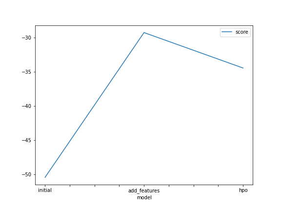
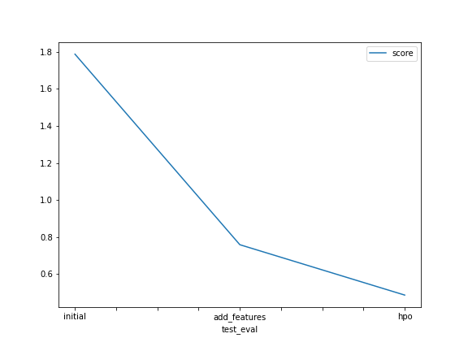

# Report: Predict Bike Sharing Demand with AutoGluon Solution
#### NAME HERE

## Initial Training
### What did you realize when you tried to submit your predictions? What changes were needed to the output of the predictor to submit your results?
Some of the predictions are negative, and I had to replace them with zero.

### What was the top ranked model that performed?
WeightedEnsemble_L3

## Exploratory data analysis and feature creation
### What did the exploratory analysis find and how did you add additional features?
Year, month, day, and hour were extracted from the datetime and added as additional features. Season and weather features were converted into categorical features.

### How much better did your model preform after adding additional features and why do you think that is?
The score improves from 1.78803 to 0.75769. This is likely due to the extracted year, month, day, and hour are important features for predicting rental count.

## Hyper parameter tuning
### How much better did your model preform after trying different hyper parameters?
The score improves from 0.75769 to 0.48532.

### If you were given more time with this dataset, where do you think you would spend more time?
1. Do some error analysis to identify if there is any pattern in the feature values where the model perform poorly. 
   Based on this analysis, we can potentially engineer new features from the dataset.
2. Explore other hyperparameter values that haven't been covered in the parameter tuning.

### Create a table with the models you ran, the hyperparameters modified, and the kaggle score.
|model|learning_rate|activation|layers|score|
|--|--|--|--|--|
|initial|default|default|default|1.78803|
|add_features|default|default|default|0.75769|
|hpo|ag.space.Real(1e-4, 1e-2)|ag.space.Categorical('relu', 'tanh')|ag.space.Categorical([100], [100, 100], [100, 100, 100])|0.48532|

### Create a line plot showing the top model score for the three (or more) training runs during the project.

### Create a line plot showing the top kaggle score for the three (or more) prediction submissions during the project.

## Summary
This project demonstrates that Autogluon is a powerful tool to quickly explore many regression models. 
Better feature engineering and hyperparameter tuning improve the model performance. The performance can
potentially be improved by error analysis of the model and further hyperparameter tuning.
